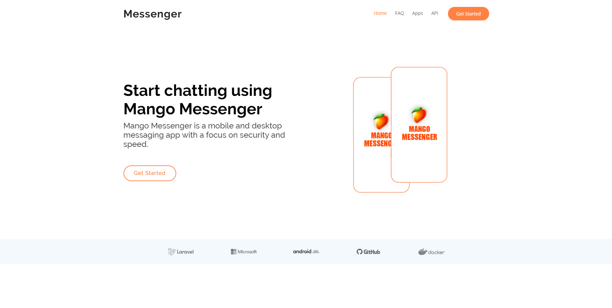

# Mango Messenger Official Web Page

Mango Messenger is a mobile and desktop messaging app with a focus on security and speed. 



## Getting Started

### Installing

A step by step series of examples that tell you how to get a development env running

1 - Clone this project inside your working folder

```
git clone https://github.com/mangomessenger/core.git
```


2 - Install all necessary libraries using Composer

```
composer install
```

3 - Enter the core folder and rename env.example to .env

```
cp .env.example .env 
```

4 - Specify the database credentials in .env

```
DB_CONNECTION=mysql
DB_HOST=127.0.0.1
DB_PORT=3306
DB_DATABASE=laravel
DB_USERNAME=root
DB_PASSWORD=
```

5 - Run migrations

```
php artisan migrate
```

6 - Generate app key

```
php artisan key:generate 
```

7 - Run your local server

```
php artisan serve
```

## Running the tests

```
php artisan test
```

## TODO List

* Changeable order of params
* Add users page in Panel
* Add news page
* Add apps page
* Redis
* Complete tests

## Built With

* [Laravel](https://laravel.com) - Laravel
* [Docker](https://www.docker.com) - Docker
